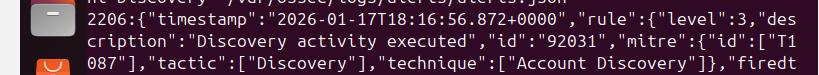
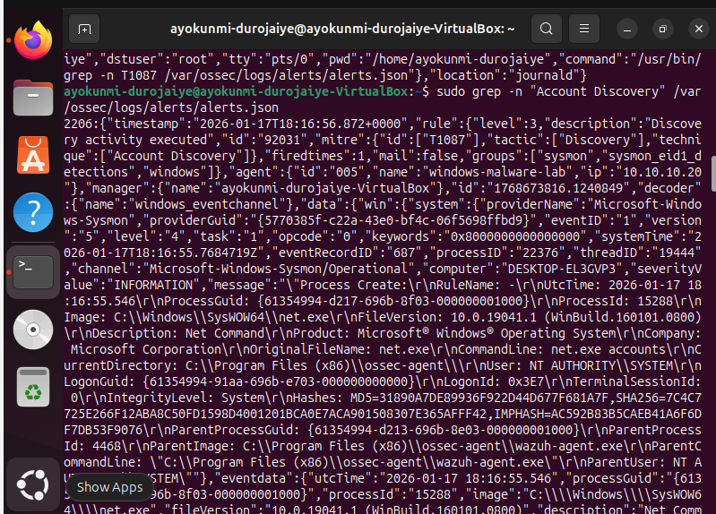
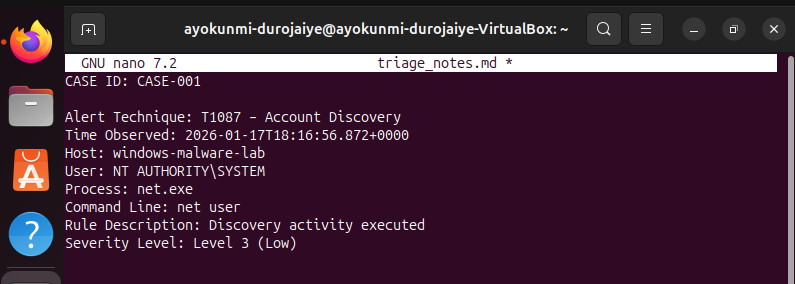
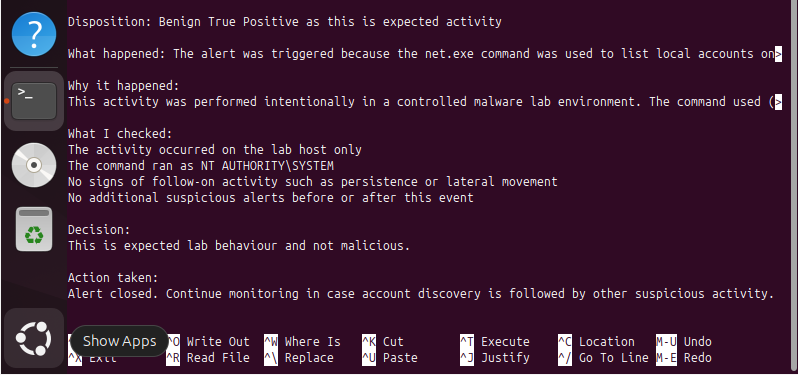

#  SOC Alert Triage Lab (Wazuh SIEM)

This project demonstrates a realistic SOC Level 1 alert triage workflow using a Wazuh SIEM home lab.
The objective was to take a real alert from detection through investigation, decision-making, and closure, following how a SOC analyst would operate in practice.

The alert investigated in this case was MITRE ATT&CK T1087 – Account Discovery, generated from activity on a Windows endpoint and analysed entirely from the SIEM using raw alert logs.

---

## **Lab Environment**

- Wazuh SIEM Manager running on Ubuntu
- Windows endpoint monitored via Wazuh Agent and Sysmon
- Alerts investigated directly from alerts.json and associated endpoint telemetry
- Controlled lab environment with simulated attacker activity (no real malware)

---

## **Step 1: Alert Existence Confirmed**

The first step in triage is confirming that the alert exists in the SIEM’s **source-of-truth logs**, rather than relying only on dashboards.

This alert was located in Wazuh’s `alerts.json` file and confirmed as an Account Discovery detection mapped to **MITRE ATT&CK T1087**.

---

## **Step 2: Full Alert Context Reviewed**

Once confirmed, the full alert context was reviewed to understand:
- The affected host
- The executing process
- The command line used
- The MITRE ATT&CK mapping
- The severity level

This provided the necessary technical context before making any judgement.

---

## **Step 3: Triage Notes and Initial Analysis**

Before making a decision, the alert details were documented in structured triage notes, capturing the **who, what, when, and where** of the event.

This mirrors standard SOC practice and ensures decisions are evidence-based.

---

## **Step 4: Decision, Rationale, and Alert Closure**

After analysing the alert context and scope, the alert was classified as a **Benign True Positive (Expected Activity)**.

**Decision summary:**
- The command was executed intentionally in a controlled malware lab
- The activity was limited to a single host
- No follow-on malicious behaviour was observed
- The detection fired correctly and was mapped accurately

The alert was closed with a recommendation to continue monitoring for any subsequent discovery or persistence activity.

---

## **Final Outcome**

- Alert classification: **Benign True Positive**
- Detection validated successfully
- No escalation required
- SOC-style documentation completed

---

## **Key Skills Demonstrated**

- SOC Level 1 alert triage
- SIEM log analysis (Wazuh)
- MITRE ATT&CK technique validation
- Endpoint investigation using Sysmon telemetry
- Evidence-based decision making
- Alert documentation and closure

---

## **Why This Matters**

This project demonstrates practical experience beyond simply setting up a SIEM.  
It shows the ability to think like a SOC analyst, validate alerts properly, and make justified decisions based on evidence rather than assumptions.
